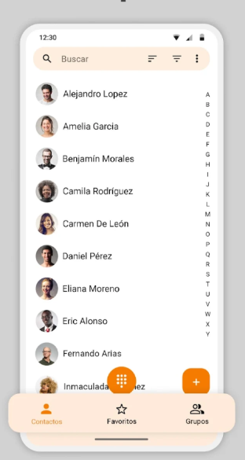

# hw_contacts

Desarrollar una aplicación móvil que permita listar y gestionar contactos, aplicando el enfoque de Domain-Driven Design (DDD) y utilizando un ORM (Drift) para la persistencia de datos en una base de datos SQLite.
La aplicación debe incluir un menú de navegación inferior (Bottom Navigation Bar) para organizar las pantallas principales del sistema.
Cada contacto deberá contar con opciones funcionales para realizar llamadas telefónicas y enviar correos electrónicos directamente desde la aplicación.

## Referencia

